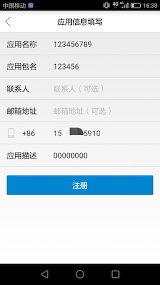

# 1.开发指南

本文档对使用SDK时所用的一些参数、方法进行说明，为开发者提供简单易用的API，并附有示例代码分析。

## 1.1. 名词解释


| 名词 | 说明 |
| --- | --- |
| APP_ID | 应用在中国移动统一认证平台申请的应用标识 |
| APP_KEY | 应用在中国移动统一认证平台申请的应用密钥 |
| TOKEN | 通过中间件签发的身份登录标识 |
| sourceId | 应用在中国移动统一认证平台申请的应用业务ID  |

## 1.2. 中间件集成前的准备

### 1.2.1. 取应用签名

在统一认证平台注册应用时，需要用到应用的签名，下面是签名获取办法：
统一认证平台提供应用签名获取工具APP(gensignature.apk)，用户把此APP安装到，启动应用签名获取APP，然后输入自己的APP的包名(如：com.cmic.sso.myapplication)，点击获取签名按钮，在下面会显示获取到的签名字符串，如下图：


### 1.2.2. 开放平台注册

地址：http://dev.10086.cn/
注册：


激活账号并登录成功后，选择能力接入


填写应用信息：


点击新增业务


提交完成后，继续填写应用信息
选择所属业务为刚刚创建的业务
能力勾选统一认证

#1.2.2快速注册
1.下载安装 开源社区demo.apk并且安装到一部安卓终端设备


2.打开运行 开源社区自动获取到本机的手机号码


3.点击应用注册


4.除了可选的选项都需要填入必要的信息



5.注册成功后获得相应的AppID 和AppKey


## 1.3. SDK集成步骤

总体使用流程：
集成后 -客户端获取accessToken
应用开发者直接调用SDK接口来获得accessToken；步骤如下：
1.	构造SDK中认证工具类AuthnHelper的对象；
2.	使用AuthnHelper中的umcLoginByType方法，获得accessToken；

客户端通过accessToken获取用户信息
使用AuthnHelper中的tokenValidate方法，获得用户信息。

### 1.3.1. 新建工程并导入SDK的jar文件

1、将CMCCSSOSDK_*.jar拷贝到应用工程的libs目录下，如没有该目录，可新建；
2、将sdk所需要的.so库文件拷贝到项目jniLibs/ 目录下
3、将sdk 所需要的证书文件 clientCert.crt、serverPublicKey.pem拷贝到项目assets目录下。


4、将sdk所需要的资源文件从res目录下的文件添加到项目工程中，如图：
anim文件：


drawable、drawable-xxhdpi文件：


layout文件：


values文件：


### 1.3.2. 配置AndroidManifest

注意：为避免出错，请直接从Demo中复制带<!-- required -->标签的代码
1、配置权限

```
<uses-permission android:name="android.permission.INTERNET" />
<uses-permission android:name="android.permission.READ_PHONE_STATE" />
<uses-permission android:name="android.permission.ACCESS_WIFI_STATE" />
<uses-permission android:name="android.permission.ACCESS_NETWORK_STATE" />
<uses-permission android:name="android.permission.SEND_SMS" />
<uses-permission android:name="android.permission.CHANGE_NETWORK_STATE" />
<uses-permission android:name="android.permission.WRITE_SETTINGS"/>
<uses-permission android:name="android.permission.WRITE_EXTERNAL_STORAGE" />
```

2、配置授权登录activity
第三方AP根据需要配置横竖屏方向：android:screenOrientation
示列代码为unspecified（默认值由系统选择显示方向）

```
<activity
    android:name="com.cmic.sso.sdk.activity.OAuthActivity"
    android:configChanges="orientation|keyboardHidden|screenSize"
    android:screenOrientation="unspecified"
    android:launchMode="singleTop">
</activity>
<!-- required -->
<activity
    android:name="com.cmic.sso.sdk.activity.BufferActivity"
    android:configChanges="orientation|keyboardHidden|screenSize"
    android:screenOrientation="unspecified"
    android:launchMode="singleTop">
</activity>
<!-- required -->
<activity
    android:name="com.cmic.sso.sdk.activity.LoginAuthActivity"
    android:configChanges="orientation|keyboardHidden|screenSize"
    android:screenOrientation="unspecified"
    android:launchMode="singleTop">
</activity>
```

通过以上两个步骤，工程就已经配置完成了。接下来就可以在代码里使用统一认证的SDK进行开发了

### 1.3.3. 使用步骤

1、AuthnHelper是SDK的功能入口，所有的接口调用都得通过AuthnHelper进行调用。因此，调用SDK，首先需要创建一个AuthnHelper实例，其代码如下：

```java
public void onCreate(Bundle savedInstanceState) {
    super.onCreate(savedInstanceState);
    mContext = this;    
…
    mAuthnHelper = AuthnHelper.getInstance(mContext);
    }
```

2、实现回调
所有的SDK接口调用，都会传入一个回调，用以接收SDK返回的调用结果。结果以JsonObjent的形式传递，TokenListener的实现示例代码如下：

```java
mListener = new TokenListener() {
    @Override
    public void onGetTokenComplete(JSONObject jObj) {
        if (jObj != null) {
            mResultString = jObj.toString();
            mHandler.sendEmptyMessage(RESULT);
            if (jObj.has("token")) {
                mAccessToken = jObj.optString("token");
            }
        }

    }
};
```

3、接口调用
示例如下：

```java
mAuthnHelper.umcLoginByType(Constant.APP_ID, 
        Constant.APP_KEY, Constant.SOURCEID, 
        AuthnHelper.UMC_LOGIN_IMPLICIT,
        AuthnHelper.AUTH_TYPE_DYNAMIC_SMS + AuthnHelper.AUTH_TYPE_WAP, 
        mListener);
```

# 2.SDK接口说明

## 2.1. 构造SDK中认证工具类AuthnHelper的对象


### 2.1.1 对象说明

**功能**

获取管理类的实例对象

**原型**

```java
public AuthnHelper (Context context)
```

### 2.1.2 参数说明

| 参数 | 类型 | 说明 |
| --- | --- | --- |
| context |Context | 调用者的上下文环境，其中activity中this即可以代表。 |


## 2.2. AuthnHelper中的umcLoginByType方法


### 2.2.1 接口说明

**功能**

接口用于获取统一认证的身份标识（不返回应用密码）；对于不使用显式登录的应用，使用该接口获取token，自动登录失败后，由SDK弹出用户名密码输入框由用户手动登录。接口中loginType登录方式中不包含mannal登录方式时，中间件只会尝试使用本机号码签发token。

**原型**

```java
javapublic void umcLoginByType(final String appId, 
			final String appKey, 
			final String sourceId, 
			final int loginType, 
			final String authType, 
			final TokenListener listener)
```

### 2.2.2 参数说明

**输入**


| 参数 | 类型 |说明|
| :--- | :--- | :--- |
| appid |String | 应用的AppID； |
| appkey | String | 应用密钥； |
| sourceId|  | 在开放平台申请能力应用的sourceId |
| loginType | String | 登录类型,包含三种登录类型:1.AuthnHelper.UMC_LOGIN_DISPLAY 显式登录;2.AuthnHelper. UMC_LOGIN_IMPLICIT 隐式登录。3.AuthnHelper.UMC_LOGIN_OAUTH 短信验证码登录。|
|authType | String | 认证类型,暂时包含两种登录类型:（认证方式可以组合用“+”号进行拼接，SDK优先选择网关鉴权方式进行认证，当认证失败的时候再进行短信验证码方式登录）1.AuthnHelper.AUTH_TYPE_DYNAMIC_SMS//短信验证码2.AuthnHelper.AUTH_TYPE_WAP//网关鉴权。如：AuthnHelper.AUTH_TYPE_WAP + AuthnHelper.AUTH_TYPE_WAP|
| listener | TokenListener | TokenListener为回调监听器，是一个java接口，需要调用者自己实现；TokenListener是接口中的认证登录token回调接口，OnGetTokenComplete是该接口中唯一的抽象方法，即voidOnGetTokenComplete(JSONObject  jsonobj)；|


**输出**

OnGetTokenComplete的参数JSONObject，含义如下：


| 字段 | 类型 | 含义 |
| --- | --- | --- |
| resultCode | Int | 接口返回码，“102000”为成功。具体响应码见附录； |
| desc | String | 失败时返回：返回错误码说明 |
| token | String | 成功时返回：身份标识，字符串形式的token，第三方应用将该凭证经应用平台向IDMP平台请求认证； |
| passid | String | 成功时返回：标示用户和通行证。 |


### 2.2.3 示例

**代码**

```java
mAuthnHelper.umcLoginByType(Constant.APP_ID, 
        Constant.APP_KEY, Constant.SOURCEID,
        AuthnHelper.UMC_LOGIN_DISPLAY, 
        AuthnHelper.AUTH_TYPE_DYNAMIC_SMS + AuthnHelper.AUTH_TYPE_WAP, 
        mListener);
```

**返回**

```
{
    "authtype": "网关鉴权",
    "resultCode": "102000",
    "passid": "543830395",
    "token": "84840100013202003A4E7A413252545133526B464752545135526A4D785244673340687474703A2F2F3132302E3139372E3233352E32373A383038302F72732F403031030004035CFFB3040006313030303030FF00206D67793F5DD933D91D6ED2A2814026DFE4A9F18E65EF228B5D58F90F41CDFE17"
}
```

## 2.3. AuthnHelper中的tokenValidate方法


### 2.3.1 接口说明

**功能**

校验token

**原型**

```java
public void tokenValidate(final String appId,
                          final String appKey,
                          final String sourceId,
                          final String token, 
final TokenListener listener)  

```

### 2.3.2 参数说明

**输入**


| 参数 | 类型 | 说明 |
| --- | --- | --- |
| appid | String | 应用的AppID； |
| appkey | String | 应用密钥； |
| sourceId | String | 在开放平台申请能力应用的sourceId |
| token | String | 登录成功的时候返回的token字符串。 |
| listener | TokenListener | TokenListener为回调监听器，是一个java接口，需要调用者自己实现；TokenListener是接口中的认证登录token回调接口，OnGetTokenComplete是该接口中唯一的抽象方法，即voidOnGetTokenComplete(JSONObject  jsonobj)； |


**输出**

| 参数名称 | 约束 | 层级 | 参数类型 | 说明 |
| --- | --- | --- | --- | --- |
| header | 必选 | 1 |  |  |
| version | 必选 | 2 | string | 1.0  |
| inresponseto |  必选| 2 | string |  对应的请求消息中的msgid|
| systemtime | 必选 |  2|string  | 响应消息发送的系统时间，精确到毫秒，共17位，格式：20121227180001165 |
| resultcode | 必选 | 2 | string | 返回码 |
| body | 必选 | 1 |  |  |
|userid  | 必选 | 2 | string |系统中用户的唯一标识  |
| pcid | 必选 |  2| string | 伪码id |
| usessionid |可选  | 2 |string  |  暂忽略|
| passid | 可选| 2 | string | 用户统一账号的系统标识 |
|andid  | 可选 | 2 | string | 用户的“和ID” |
| msisdn | 可选 | 2 | string | 表示手机号码 |
| email | 可选 | 2 | string |表示邮箱地址  |
| loginidtype | 可选 | 2 | string |登录使用的用户标识：0：手机号码 1：邮箱|
| msisdntype |  可选| 2 | string | 手机号码的归属运营商：0：中国移动 1：中国电信 2：中国联通 99：未知的异网手机号码 |
| province | 可选 | 2 | string | 用户所属省份(暂无) |
| authtype | 可选 |2  | string | 认证方式，取值参见附录三 |
| authtime | 可选 | 2 | string  | 统一认证平台认证用户的时间 |
| lastactivetime |  可选| 2 |   string| 暂无 |
| relateToAndPassport |  可选| 2 |  string | 是否已经关联到统一账号，暂无用处 |
|fromsourceid  | 可选 | 2 |  string |来源sourceid（即签发token sourceid）  |
| tosourceid |可选  | 2 |  string |目的sourceid（即被登录业务sourceid）|

### 2.3.3 示例

**代码**


```java
mAuthnHelper.tokenValidate(Constant.APP_ID,
        Constant.APP_KEY,
        Constant.SOURCEID,
        mAccessToken,
        mListener);
```

**返回**

```
{
    "body": {
        "passid": "543**0395",
        "authtype": "WAPGW",
        "authtime": "2017-08-09 10:52:33",
        "loginidtype": "0",
        "usessionid": "NzA2RTQ3RkFGRTQ5RjMxRDg3@http://120.197.235.27:8080/rs/@01",
        "msisdn": "1380****380",
        "lastactivetime": "",
        "relateToAndPassport": "1",
        "msisdntype": "0"
    },
    "header": {
        "inresponseto": "93ab5005024d4fa699b9208c640ab061",
        "resultcode": "103000",
        "systemtime": "20170809105307821",
        "version": "1.0"
    }
}
```

# 3.平台接口说明

## 3.1. 校验token接口

### 3.1.1 接口说明

**功能**

业务平台app或服务端携带用户授权成功后的token来调用SDK服务端的相应访问用户资源的接口。


**原型**

请求地址:http://www.cmpassport.com:8080/rs/client/rsapi/tokenValidate
协议:HTTP
请求方法:POST+json

### 3.1.2 参数说明

**输入**


| 参数名称 | 约束 | 层级 | 参数类型 | 说明 |
| --- | --- | --- | --- | --- |
| header | 必选 | 1 |  |  |
| version | 必选 | 2 | string | 填1.0 |
| msgid | 必选 | 2 | string | 标识请求的随机数即可(1-36位) |
| systemtime | 必选 | 2 | string |请求消息发送的系统时间，精确到毫秒，共17位，格式：20121227180001165 |
| strictcheck | 必选 | 2 | string | 验证源ip合法性，填写”1”，统一认证会校验sourceid与出口ip对应关系（申请sourceid时需提供业务出口ip，可以多个IP）|
| sourceid | 可选 | 2 | string | 业务集成统一认证的标识，需提前申请，申请指南见附录一 |
| ssotosourceid | 可选 | 2 | string | 单点登录时使用，填写被登录业务的sourceid |
| appid | 可选 | 2 | string | 业务在统一认证申请的应用id|
| apptype | 可选 | 2 | string |  参见附录“渠道编码定义”1:BOSS 2:web 3:wap 4:pc客户端 5:手机客户端|
| expandparams | 扩展参数 | 2 | string | map(key,value) |
| body | 可选 | 1 |  |  |
| token | 可选 | 2 | string | 需要解析的凭证值。 |


**输出**

| 参数名称 | 约束 | 层级 | 参数类型 | 说明 |
| --- | --- | --- | --- | --- |
| header | 必选 | 1 |  |  |
| version | 必选 | 2 | string | 1.0  |
| inresponseto |  必选| 2 | string |  对应的请求消息中的msgid|
| systemtime | 必选 |  2|string  | 响应消息发送的系统时间，精确到毫秒，共17位，格式：20121227180001165 |
| resultcode | 必选 | 2 | string | 返回码 |
| body | 必选 | 1 |  |  |
|userid  | 必选 | 2 | string |系统中用户的唯一标识  |
| pcid | 必选 |  2| string | 伪码id |
| usessionid |可选  | 2 |string  |  暂忽略|
| passid | 可选| 2 | string | 用户统一账号的系统标识 |
|andid  | 可选 | 2 | string | 用户的“和ID” |
| msisdn | 可选 | 2 | string | 表示手机号码 |
| email | 可选 | 2 | string |表示邮箱地址  |
| loginidtype | 可选 | 2 | string |登录使用的用户标识：0：手机号码 1：邮箱|
| msisdntype |  可选| 2 | string | 手机号码的归属运营商：0：中国移动 1：中国电信 2：中国联通 99：未知的异网手机号码 |
| province | 可选 | 2 | string | 用户所属省份(暂无) |
| authtype | 可选 |2  | string | 认证方式，取值参见附录三 |
| authtime | 可选 | 2 | string  | 统一认证平台认证用户的时间 |
| lastactivetime |  可选| 2 |   string| 暂无 |
| relateToAndPassport |  可选| 2 |  string | 是否已经关联到统一账号，暂无用处 |
|fromsourceid  | 可选 | 2 |  string |来源sourceid（即签发token sourceid）  |
| tosourceid |可选  | 2 |  string |目的sourceid（即被登录业务sourceid）|

### 3.1.3 示例

**请求示例**

```

		{
		"header": {
			"strictcheck":"0",
			"version": "1.0",
			"msgid": "40a940a940a940a93b8d3b8d3b8d3b8d",
			"systemtime": "20170515090923489",
			"appid": "10000001",
			"apptype": "5"
		},
		"body": {
			"token": "8484010001320200344E6A5A4551554D784F444E474E446C434E446779517A673340687474703A2F2F3139322E3136382E31322E3233363A393039302F0300040353EA68040006313030303030FF00203A020A143C6703D7D0530953C760744C7D61F5F7B546F12BC17D65254878748C"
		}
	   }
```

**返回**

```
 {
		"body": {
			"msisdntype": "0",
			"usessionid": "NjZEQUMxODNGNDlCNDgyQzg3@http://192.168.12.236:9090/",
			"passid": "000000000",
			"loginidtype": "0",
			"authtime": "2017-05-22 20:48:45",
			"msisdn": "13683329795",
			"lastactivetime": "",
			"authtype": "WAPGW",
			"relateToAndPassport": "1"
		},
		"header": {
			"inresponseto": "40a940a940a940a93b8d3b8d3b8d3b8d",
			"resultcode": "103000",
			"systemtime": "20170522204845598",
			"version": "1.0"
		}
	  }
```

# 4.错误码说明

使用SDK时，SDK会在认证结束后将结果回调给开发者，其中结果为JSONObject对象，其中resultCode为结果响应码，102000和103000代表成功，其他为失败。成功时在根据token字段取出身份标识。失败时根据resultCode定位失败原因。
错误

## 4.1.SDK客户端类错误

| 错误编号 | 返回码描述 |
| --- | --- |
| 102101 | 无网络 |
| 102102 | 网络异常 |
| 102223| 数据解析异常 |
| 102121 | 用户取消认证 |
| 102505 | 业务未注册 |
| 102506 | 请求出错 |
| 102507 | 请求超时 |
| 102201 | 自动登陆失败 |
| 102202 | 应用签名失败 |
| 102203 | 输入参数错误 |
| 102204 | 正在gettoken处理 |
| 102210 | 指定号码非本机号码 |
| 102211 | 短信验证码验证成功后返回随机码为空 |
| 102222 | http响应头中没有结果码 |
| 102299 | other failed |
| 102302 | 调用service超时 |
| 103117 | mac异常 macError |
|103200| ks无需更新 |
| 103203 | 缓存用户不存在 |
| 200001 | imsi为空，跳到短信验证码登录 |
| 200002 | imsi为空，没有短信验证码登录功能 |
| 200003 | 复用中间件首次登录 |
| 200004 | 复用中间件二次登录 |
| 200005 | 用户未授权 |
| 200006 | 用户未授权 |
| 200007 | 不支持的认证方式 跳到短信验证码登录|
| 200008 |不支持的认证方式 没有短信验证码登录功能 |
| 200009 |应用合法性校验失败|

## 4.2. 平台类错误

| 错误编号 | 返回码描述 |
| --- | --- |
| 103101 | 签名错误 |
| 103103 | 用户不存在 |
| 103104 | 用户不支持该种登录方式 |
| 103105 | 密码错误 |
| 103106 | 用户名错误 |
| 103107 | 已存在相同的随机数 |
| 103108 | 短信验证码错误 |
| 103109 | 短信验证码超时 |
| 103111 | WAP网关IP不合法 |
| 103112 | 请求错误 reqError |
| 103113 | Token内容错误 |
| 103114 | token验证 KS过期 |
| 103115 | token验证 KS不存在 |
| 103116 | token验证 sqn错误 |
| 103117 | mac异常 macError |
| 103118 | sourceid不存在 |
| 103119 | appid不存在appidNOExist |
| 103120 | clientauth不存在 |
| 103121 | passid不存在 |
| 103122 | btid不存在 |
| 103123 | redisinfo不存在 |
| 103124 | ksnaf校验不一致 |
| 103125 | 手机格式错误 |
| 103126 | 手机号不存在 |
| 103127 | 证书验证，版本过期 |
| 103128 | gba webservice接口调用失败 |
| 103129 | 获取短信验证码的msgtype异常 |
| 103130 | 新密码不能与当前密码相同 |
| 103131 | 密码过于简单 |
| 103132 | 用户注册失败 |
| 103133 | sourceid不合法 |
| 103134 | wap方式手机号为空 |
| 103135 | 昵称非法 |
| 103136 | 邮箱非法 |
| 103138 | appid已存在 |
| 103139 | sourceid已存在 |
| 103200 | 不需要更新ks |
| 103204 | 缓存随机数不存在 |
| 103205 | 服务器内部异常 |
| 103207 | 发送短信失败 |
| 103212 | 校验密码失败 |
| 103213 | 旧密码错误 |
| 103214 | 访问缓存或数据库错误 |
| 103226 | sqn过小或过大 |
| 103265 | 用户已存在 |
| 103901 | 短信验证码下发次数已达上限 |
| 103902 | 凭证校验失败 |
| 104001 | APPID和APPKEY已存在 |
| 105001 | 联通网关取号失败 |
| 105002 | 移动网关取号失败 |
| 105003 | 电信网关取号失败 |
| 105004 | 短信上行ip检测不合法 |
| 105005 | 短信上行发送信息为空 |
| 105006 | 手机号码为空 |
| 105007 | 手机号码格式错误 |
| 105008 | 短信内容为空 |
| 105009 | 解析失败 |

